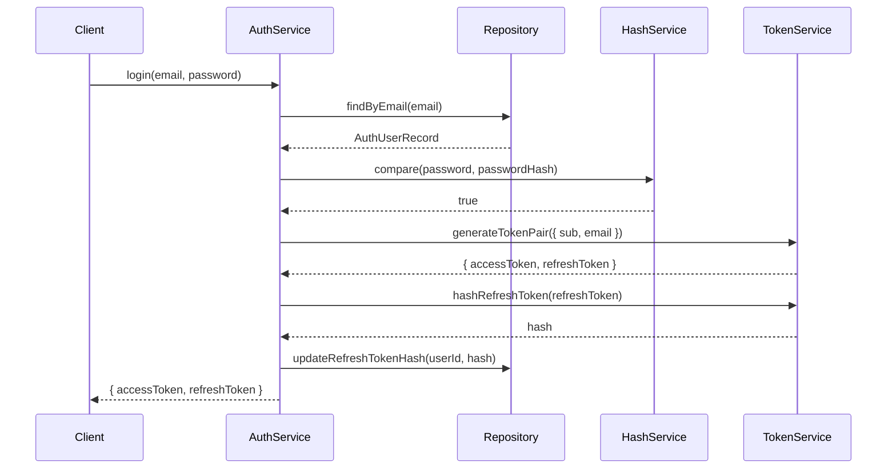
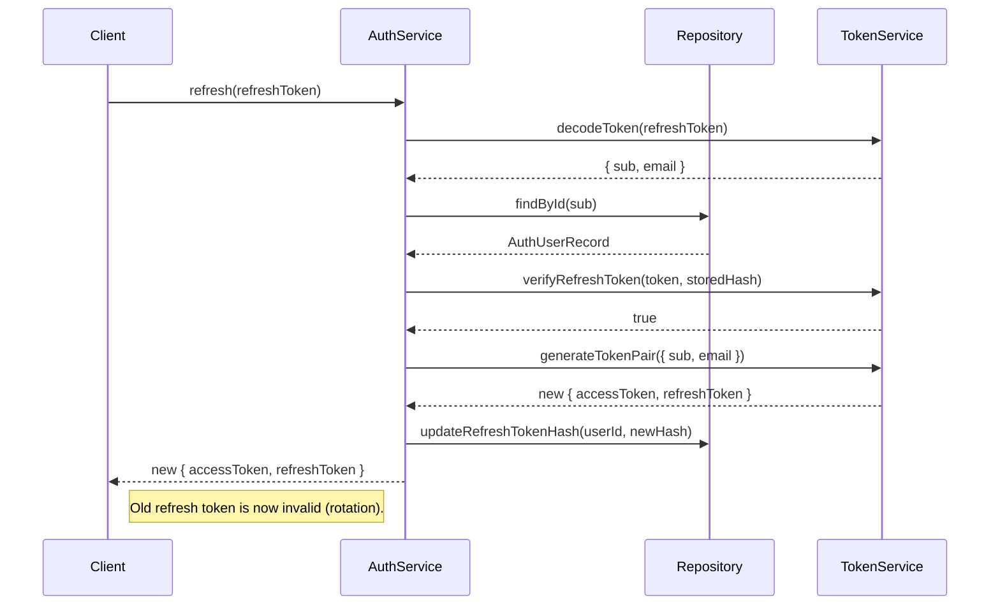

# @opkod-france/nestjs-auth

[](https://github.com/opkod-france/nestjs-auth/actions/workflows/ci.yml)
[](https://github.com/opkod-france/nestjs-auth/actions/workflows/release.yml)
[](https://github.com/semantic-release/semantic-release)
[](https://nestjs.com)
[](https://opensource.org/licenses/MIT)

NestJS authentication module with JWT access/refresh tokens, bcryptjs password hashing, and optional event emission.

## Table of contents

- [Architecture](#architecture)
- [Installation](#installation)
- [Quick start](#quick-start)
- [Configuration](#configuration)
- [Guards and decorators](#guards-and-decorators)
- [Token refresh flow](#token-refresh-flow)
- [Events](#events)
- [Custom HashService](#custom-hashservice)
- [API reference](#api-reference)
- [License](#license)

## Architecture

```mermaid
graph LR
    Request["HTTP Request"] --> Guard

    subgraph AuthModule
        Guard["JwtAuthGuard"]
        Guard -->|validate JWT| Strategy["JwtStrategy"]
        Service["AuthService"]
        Service --> Token["TokenService"]
        Service --> Hash["HashService"]
        Service -->|on login/logout| Events["EventEmitter2?"]
    end

    Service --> Repo["AuthUserRepository"]
    Repo --> DB[(Your Database)]
    Guard -->|@Public| Handler["Route Handler"]
    Guard -->|valid JWT| Handler
    Guard -->|invalid| Unauthorized["401 Unauthorized"]
```

### Login flow



### Token refresh flow



## Installation

```bash
npm install @opkod-france/nestjs-auth
```

### Peer dependencies

| Package | Required |
|---------|----------|
| `@nestjs/common` | `^10 \|\| ^11` |
| `@nestjs/core` | `^10 \|\| ^11` |
| `@nestjs/jwt` | `^10 \|\| ^11` |
| `@nestjs/passport` | `^10 \|\| ^11` |
| `passport-jwt` | `^4` |
| `rxjs` | `^7` |
| `bcryptjs` | Optional — required if using the default `BcryptjsHashService` |
| `@nestjs/event-emitter` | Optional — enables auth event emission |

## Quick start

### 1. Implement `AuthUserRepository`

```ts
import { Injectable } from '@nestjs/common';
import { AuthUserRepository, AuthUserRecord } from '@opkod-france/nestjs-auth';

@Injectable()
export class UserRepository extends AuthUserRepository {
  constructor(private readonly db: DatabaseService) {
    super();
  }

  async findByEmail(email: string): Promise<AuthUserRecord | null> {
    return this.db.query('SELECT * FROM users WHERE email = $1', [email]);
  }

  async findById(id: string): Promise<AuthUserRecord | null> {
    return this.db.query('SELECT * FROM users WHERE id = $1', [id]);
  }

  async updateRefreshTokenHash(userId: string, hash: string | null): Promise<void> {
    await this.db.query(
      'UPDATE users SET refresh_token_hash = $1 WHERE id = $2',
      [hash, userId],
    );
  }
}
```

### 2. Register the module

```ts
import { Module } from '@nestjs/common';
import { AuthModule, AUTH_USER_REPOSITORY } from '@opkod-france/nestjs-auth';
import { UserRepository } from './user.repository';

@Module({
  imports: [
    AuthModule.forRoot({
      jwt: {
        secret: process.env.JWT_SECRET,
        accessExpiresIn: '15m',
        refreshExpiresIn: '7d',
      },
    }),
  ],
  providers: [
    { provide: AUTH_USER_REPOSITORY, useClass: UserRepository },
  ],
})
export class AppModule {}
```

### 3. Use in controllers

```ts
import { Controller, Post, Body, UseGuards } from '@nestjs/common';
import {
  AuthService,
  JwtAuthGuard,
  CurrentUser,
  Public,
} from '@opkod-france/nestjs-auth';

@UseGuards(JwtAuthGuard)
@Controller('auth')
export class AuthController {
  constructor(private readonly authService: AuthService) {}

  @Public()
  @Post('login')
  login(@Body() body: { email: string; password: string }) {
    return this.authService.login(body.email, body.password);
  }

  @Public()
  @Post('refresh')
  refresh(@Body() body: { refreshToken: string }) {
    return this.authService.refresh(body.refreshToken);
  }

  @Post('logout')
  logout(@CurrentUser('sub') userId: string) {
    return this.authService.logout(userId);
  }
}
```

## Configuration

### `AuthModuleOptions`

| Option | Type | Default | Description |
|--------|------|---------|-------------|
| `jwt.secret` | `string` | — | JWT signing secret (required) |
| `jwt.accessExpiresIn` | `string \| number` | `'15m'` | Access token expiry |
| `jwt.refreshExpiresIn` | `string \| number` | `'7d'` | Refresh token expiry |
| `hash.rounds` | `number` | `10` | bcryptjs hash rounds |

### Async configuration

```ts
AuthModule.forRootAsync({
  useFactory: (config: ConfigService) => ({
    jwt: {
      secret: config.get('JWT_SECRET'),
      accessExpiresIn: config.get('JWT_ACCESS_EXPIRES_IN', '15m'),
      refreshExpiresIn: config.get('JWT_REFRESH_EXPIRES_IN', '7d'),
    },
    hash: { rounds: 12 },
  }),
  inject: [ConfigService],
})
```

## Guards and decorators

### `JwtAuthGuard`

Extends Passport's `AuthGuard('jwt')`. All routes are protected by default.

```ts
@UseGuards(JwtAuthGuard)
@Controller('users')
export class UsersController {
  @Get('me')
  getProfile(@CurrentUser() user: UserIdentity) {
    return user; // { sub: '...', email: '...' }
  }
}
```

### `@Public()`

Marks a route as publicly accessible, bypassing `JwtAuthGuard`:

```ts
@Public()
@Get('health')
health() {
  return { status: 'ok' };
}
```

### `@CurrentUser(property?)`

Extracts the authenticated user (or a specific property) from `request.user`:

```ts
@CurrentUser()         // full UserIdentity
@CurrentUser('sub')    // just the user ID string
@CurrentUser('email')  // just the email string
```

## Events

When `@nestjs/event-emitter` is installed and `EventEmitterModule` is registered, the following events are emitted:

| Event | Payload | When |
|-------|---------|------|
| `auth.login` | `LoginEvent { userId, email }` | Successful login |
| `auth.login.failed` | `LoginFailedEvent { email, reason }` | Failed login attempt |
| `auth.logout` | `LogoutEvent { userId }` | User logout |

`LoginFailedEvent.reason` is `'user_not_found' | 'invalid_password'`.

```ts
import { OnEvent } from '@nestjs/event-emitter';
import { LoginFailedEvent } from '@opkod-france/nestjs-auth';

@Injectable()
export class SecurityLogger {
  @OnEvent('auth.login.failed')
  handleLoginFailed(event: LoginFailedEvent) {
    console.warn(`Failed login for ${event.email}: ${event.reason}`);
  }
}
```

## Custom HashService

Override the default bcryptjs implementation by extending the abstract `HashService`:

```ts
import { Injectable } from '@nestjs/common';
import { HashService } from '@opkod-france/nestjs-auth';

@Injectable()
export class Argon2HashService extends HashService {
  async hash(data: string): Promise<string> { /* ... */ }
  async compare(data: string, hash: string): Promise<boolean> { /* ... */ }
}

// In your module:
{ provide: HashService, useClass: Argon2HashService }
```

## API reference

### `AuthService`

| Method | Description |
|--------|-------------|
| `login(email, password)` | Validates credentials, returns `TokenPair` |
| `refresh(refreshToken)` | Rotates tokens, returns new `TokenPair` |
| `logout(userId)` | Invalidates refresh token |

### `TokenService`

| Method | Description |
|--------|-------------|
| `generateTokenPair(payload)` | Creates access + refresh JWT pair |
| `hashRefreshToken(token)` | Hashes refresh token for storage |
| `verifyRefreshToken(token, hash)` | Compares token against stored hash |
| `decodeToken(token)` | Verifies and decodes a JWT |

### Interfaces

| Interface | Fields |
|-----------|--------|
| `UserIdentity` | `sub: string`, `email?: string`, `[key: string]: unknown` |
| `AuthUserRecord` | `id`, `email`, `passwordHash`, `refreshTokenHash?` |

### Constants

| Token | Description |
|-------|-------------|
| `AUTH_USER_REPOSITORY` | DI token for the user repository |
| `AUTH_EVENT_EMITTER` | DI token for the optional EventEmitter2 |
| `IS_PUBLIC_KEY` | Metadata key set by `@Public()` |

## License

MIT
